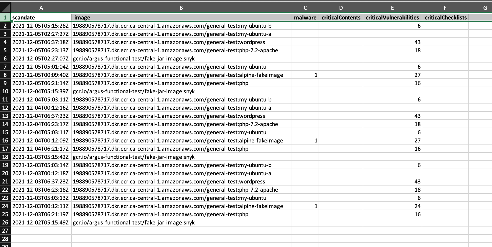

# smartCheckSecurityPosture
Creates a CSV file with Critical Scan Findings found by your SmartCheck's scans

## Clone this repo
```
git clone https://github.com/cvdabbeele/smartchecksecurityposture
```

## Build the image
```
docker build . -t smartchecksecurityposture:latest 
```

## Run the container
```
docker run --env-file PATH_TO_YOUR_LOCAL_VARIABLES.LIST-FILE -v PATH_TO_A_LOCAL_FOLDER_FOR_THE_OUTPUT_FILE:/outvol smartchecksecurityposture:latest
```
(do not change `outvol`.  It is the folder inside the container which is mapped to the `PATH_TO_A_LOCAL_FOLDER_FOR_THE_OUTPUT_FILE` )

e.g. docker run --env-file smartchecksecurityposture_variables.list -v /Users/john_doe/projects/smartCheckSecurityPosture:/outvol smartchecksecurityposture:latest

For an example of a `smartchecksecurityposture_variables.list`, see `smartchecksecurityposture_variables.list.sample`

## Open the CSV in Excel
 


## Disclaimer
This tool is provided as Open Source.
Support is on best-effort.